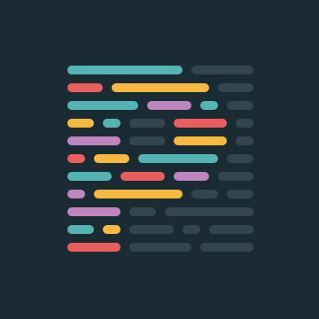

## covid-questionaire

This template should help get you started developing with Vue 3 in Vite.

#

## Recommended IDE Setup

[VSCode](https://code.visualstudio.com/) + [Volar](https://marketplace.visualstudio.com/items?itemName=Vue.volar) (and disable Vetur) + [TypeScript Vue Plugin (Volar)](https://marketplace.visualstudio.com/items?itemName=Vue.vscode-typescript-vue-plugin).

#

## Customize configuration

See [Vite Configuration Reference](https://vitejs.dev/config/).

#

## About App

This website is for registration in Redberry, you must fill inputs about your covid condition and also some info about you.

#

## Prerequisites

-  _Vue 3_

-  npm@6.14.17 and up

#

### Tech Stack

-  Vee-validate

#

## Resources

-  Figma

-  Prittier

-  ESlint

-  Tailwind

-  Vite

#

## Web Link

<a href="covid-questionnaire.giorgi-kikadze.redberryinternship.ge_">covid-questionnaire.giorgi-kikadze.redberryinternship.ge</a>

#

## Project Setup

```sh
npm install
```

### Compile and Hot-Reload for Development

```sh
npm run dev
```

### Compile and Minify for Production

```sh
npm run build
```

### Lint with [ESLint](https://eslint.org/)

```sh
npm run lint
```
